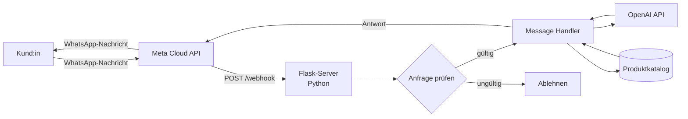

<div align="center">

# WhatsApp-KI-Assistent

**Ein interaktiver WhatsApp-Bot auf Basis der Meta Cloud API, der mit OpenAI Konversationsantworten generiert — das konversationelle Frontend für [Velo.Stor](https://github.com/El-Tousy/VELO-STOR-Online-Store).**

[**🔗 Verwandtes Projekt — Velo.Stor**](https://github.com/El-Tousy/VELO-STOR-Online-Store) · [**📄 English**](README.md)


</div>

---

## Inhaltsverzeichnis

- [Überblick](#überblick)
- [Funktionen](#funktionen)
- [Architektur](#architektur)
- [Tech-Stack](#tech-stack)
- [Projektstruktur](#projektstruktur)
- [Erste Schritte](#erste-schritte)
- [Umgebungsvariablen](#umgebungsvariablen)
- [API-Endpunkte](#api-endpunkte)
- [Tests](#tests)
- [CI/CD](#cicd)
- [Deployment](#deployment)
- [Technische Herausforderungen und Erkenntnisse](#technische-herausforderungen-und-erkenntnisse)
- [Roadmap](#roadmap)
- [Verwandtes Projekt](#verwandtes-projekt)
- [Autorin](#autorin)
- [Lizenz](#lizenz)

---

## Überblick

Dieses Projekt ist ein Webhook-Server, der WhatsApp in einen konversationellen Shop verwandelt. Er empfängt Kundennachrichten über die **Meta WhatsApp Cloud API**, interpretiert sie mit der **OpenAI API** und antwortet automatisch — unter Verwendung desselben Produktkatalogs wie die [Velo.Stor](https://github.com/El-Tousy/VELO-STOR-Online-Store)-Website.

Ziel ist es, dass Kund:innen direkt in einem WhatsApp-Chat nach Fahrrädern, E-Bikes oder Scootern fragen können — ohne App-Installation, ohne Website-Besuch. Das entspricht der Realität in Märkten, in denen WhatsApp der wichtigste Vertriebskanal kleiner Unternehmen ist.

> **Hinweis zum Umfang.** Dies ist ein Praktikums-/Lernprojekt. Der Bot und der Katalog, aus dem er schöpft, verwenden Beispieldaten; es handelt sich nicht um eine produktive kommerzielle Anwendung.

---

## Funktionen

- **Webhook-Verifizierung** — verarbeitet den `GET /webhook`-Handshake von Meta (`hub.challenge` / `hub.verify_token`)
- **Verarbeitung eingehender Nachrichten** — empfängt und parst `POST /webhook`-Payloads der Meta Cloud API
- **KI-generierte Antworten** — Kundennachrichten werden an die OpenAI API gesendet, die eine natürlichsprachliche, auf dem Produktkatalog basierende Antwort erzeugt
- **Gemeinsamer Katalog** — Antworten basieren auf denselben Produktdaten wie die Velo.Stor-Website, wodurch beide Frontends konsistent bleiben
- **Signatur-/Token-Verifizierung** — validiert eingehende Anfragen, bevor sie verarbeitet werden
- **Strukturiertes Logging** — Anfrage- und Fehlerprotokolle zur Fehlersuche bei der Webhook-Zustellung
<!-- TODO: Liste mit dem tatsächlichen Funktionsumfang abgleichen (z. B. Mediennachrichten, Quick Replies, Übergabe an einen menschlichen Agenten, Bestellstatus-Abfragen) -->

---

## Architektur



Meta leitet jede eingehende WhatsApp-Nachricht an den Webhook dieses Servers weiter. Der Server verifiziert die Anfrage, baut einen Prompt aus der Kundennachricht und relevanten Katalogdaten, sendet ihn an die OpenAI API und schickt die generierte Antwort über die Meta Cloud API an den Kunden zurück — aus demselben Katalog, den auch die [Velo.Stor](https://github.com/El-Tousy/VELO-STOR-Online-Store)-Website anzeigt.

---

## Tech-Stack

| Ebene | Technologie | Warum |
|---|---|---|
| Sprache | Python 3.11+ | — |
| Web-Framework | Flask | Schlanker Webhook-Server, ohne unnötigen Overhead |
| Messaging | Meta WhatsApp Cloud API | Offiziell, kein Risiko durch inoffizielle WhatsApp-Automatisierung |
| KI-Ebene | OpenAI API | Sprachverständnis und Generierung der Antworten |
| CI/CD | GitHub Actions | Linting, Tests und (optional) Deployment bei jedem Push |
| Hosting | <!-- TODO: z. B. Render / Railway / Fly.io / ein VPS --> | — |
| Versionierung | Git & GitHub | — |

---

## Projektstruktur

```
Meta-API-python-whatsapp-bot/
│
├── app.py                     # Flask-Einstiegspunkt, Routen-Registrierung
├── webhook/
│   ├── verify.py              # GET /webhook Handshake mit Meta
│   └── handler.py             # POST /webhook Nachrichtenverarbeitung
├── services/
│   ├── meta_client.py         # Sendet Antworten über die Meta Cloud API
│   └── openai_client.py       # Baut Prompts und ruft die OpenAI API auf
├── catalogue/
│   └── products.json          # Gemeinsame Produktdaten (spiegelt Velo.Stor)
├── tests/
│   └── test_webhook.py        # Unit-Tests für Webhook-Verifizierung und -Verarbeitung
├── .github/
│   └── workflows/
│       └── ci.yml             # Lint- und Test-Pipeline
├── .env.example                # Vorlage für benötigte Umgebungsvariablen
├── requirements.txt
├── LICENSE
└── README.md
```

> Diese Struktur spiegelt die angestrebte Organisation des Projekts wider. <!-- TODO: durch die tatsächliche Dateistruktur ersetzen, falls abweichend -->

---

## Erste Schritte

### Voraussetzungen

- Python 3.11 oder neuer
- Ein [Meta-Entwickler](https://developers.facebook.com/)-Konto mit konfigurierter WhatsApp-Business-App
- Ein [OpenAI-API](https://platform.openai.com/)-Schlüssel
- `pip` und optional ein Tool für virtuelle Umgebungen (`venv`, `poetry` usw.)

### Installation

```bash
git clone https://github.com/El-Tousy/Meta-API-python-whatsapp-bot.git
cd Meta-API-python-whatsapp-bot

python -m venv venv
source venv/bin/activate   # Windows: venv\Scripts\activate

pip install -r requirements.txt
```

### Konfiguration

```bash
cp .env.example .env
# .env anschließend mit eigenen Werten füllen — siehe Umgebungsvariablen unten
```

### Lokal ausführen

```bash
python app.py
# oder: flask run
```

Um während der lokalen Entwicklung echte WhatsApp-Nachrichten zu empfangen, den lokalen Server über einen Tunnel freigeben (z. B. `ngrok http 5000`) und die resultierende HTTPS-URL als Webhook-Callback-URL im Meta-Entwickler-Dashboard registrieren.

---

## Umgebungsvariablen

| Variable | Beschreibung |
|---|---|
| `WHATSAPP_TOKEN` | Zugriffstoken für die Meta Cloud API (System-User-Token) |
| `PHONE_NUMBER_ID` | ID der WhatsApp-Business-Telefonnummer, die Nachrichten sendet/empfängt |
| `VERIFY_TOKEN` | Selbst gewählte Zeichenfolge; muss mit dem Wert in der Meta-Webhook-Konfiguration übereinstimmen |
| `APP_SECRET` | App-Secret zur Verifizierung der Meta-Anfragesignatur |
| `OPENAI_API_KEY` | API-Schlüssel für die OpenAI API |
| `PORT` | Port, auf dem der Flask-Server lauscht (Standard `5000`) |

<!-- TODO: genaue Variablennamen mit der echten .env.example abgleichen -->

---

## API-Endpunkte

| Methode | Pfad | Beschreibung |
|---|---|---|
| `GET` | `/webhook` | Einmaliger Verifizierungs-Handshake, den Meta bei der Webhook-Registrierung nutzt |
| `POST` | `/webhook` | Empfängt eingehende WhatsApp-Nachrichten und löst den Antwort-Flow aus |
| `GET` | `/health` | Einfacher Health-Check, liefert `{ "status": "ok" }` |

<!-- TODO: Zeilen ergänzen/anpassen, falls der Bot weitere Routen bereitstellt (z. B. einen Admin-Endpunkt, einen Endpunkt zum Neuladen des Katalogs) -->

---

## Tests

```bash
pytest
```

Die Tests decken die Verifizierung der Webhook-Signatur und die Nachrichtenverarbeitungslogik isoliert ab, mit gemockten Meta- und OpenAI-Antworten, damit die Testsuite nicht von echten Zugangsdaten abhängt.
<!-- TODO: anpassen, sobald die echte Testsuite existiert -->

---

## CI/CD

Die Continuous Integration läuft bei jedem Push und Pull Request über **GitHub Actions** (`.github/workflows/ci.yml`):

```yaml
name: CI

on:
  push:
    branches: [main]
  pull_request:
    branches: [main]

jobs:
  lint-and-test:
    runs-on: ubuntu-latest
    steps:
      - uses: actions/checkout@v4

      - name: Python einrichten
        uses: actions/setup-python@v5
        with:
          python-version: "3.11"

      - name: Abhängigkeiten installieren
        run: |
          pip install -r requirements.txt
          pip install flake8 pytest

      - name: Linting
        run: flake8 .

      - name: Tests ausführen
        run: pytest
```

Die Pipeline:
1. **Prüft** den Code mit `flake8` auf Stil- und offensichtliche Korrektheitsprobleme vor dem Merge
2. **Führt die Testsuite** mit `pytest` bei jedem Push und Pull Request auf `main` aus
3. <!-- TODO: einen Deploy-Job ergänzen (z. B. Auslösen eines Render-/Railway-Deploy-Hooks oder Push auf einen VPS via SSH), sobald ein Hosting-Anbieter feststeht -->

Eine Branch-Protection-Regel auf `main`, die diesen Workflow als Voraussetzung für Merges verlangt, wird empfohlen.

---

## Deployment

<!-- TODO: ausfüllen, sobald ein Hosting-Anbieter feststeht. Beispielstruktur unten. -->

| Einstellung | Wert |
|---|---|
| Hosting | TODO |
| Trigger | Push auf `main` |
| Umgebungsvariablen | Im Dashboard des Hosting-Anbieters konfiguriert, analog zu `.env.example` |
| Webhook-URL | Registriert im Meta-Entwickler-Dashboard → WhatsApp → Konfiguration |

---

## Technische Herausforderungen und Erkenntnisse

- **Der Webhook-Verifizierungs-Handshake von Meta.** Der `GET /webhook`-Challenge/Response-Ablauf sowie die Signaturverifizierung (`X-Hub-Signature-256`) bei jedem `POST` müssen korrekt implementiert sein — sonst stellt Meta die Nachrichtenzustellung stillschweigend ein, ohne aussagekräftige Fehlermeldung an die Entwicklerin.
- **Prompting für fundierte Antworten.** Die OpenAI API dazu zu bringen, tatsächlich aus dem Produktkatalog zu antworten, statt plausibel klingende, aber falsche Details zu erfinden, hat mehr Prompt-Iterationen gebraucht als der Integrationscode selbst.
- **Eine gemeinsame Quelle der Wahrheit mit der Website teilen.** Den Katalog des Bots und den der Velo.Stor-Website synchron zu halten, ist die zentrale Design-Einschränkung des gesamten Zwei-Repository-Systems.
- <!-- TODO: weitere reale Herausforderungen ergänzen — z. B. Freigabe von WhatsApp-Nachrichtenvorlagen, Rate Limits, Latenz des OpenAI-Aufrufs innerhalb des Webhook-Antwortfensters -->

---

## Roadmap

- [x] Webhook-Verifizierung und Nachrichtenverarbeitung
- [x] Von OpenAI generierte Antworten
- [x] Gemeinsamer Katalog mit dem Velo.Stor-Shop
- [ ] Automatisierter Deploy-Job in der CI/CD-Pipeline
- [ ] Gesprächsverlauf / Kontext pro Kund:in
- [ ] Übergabe an einen menschlichen Agenten bei Fragen, die der Bot nicht beantworten kann
- [ ] Strukturierte Bestell-/Statusabfragen
- [ ] Testabdeckung erweitern

---

## Verwandtes Projekt

**[Velo.Stor](https://github.com/El-Tousy/VELO-STOR-Online-Store)** — die arabischsprachige RTL-E-Commerce-Website, mit der dieser Bot seinen Katalog teilt.

---

## Autorin

**El-Tousy** — Informatikstudentin, Marokko

[](https://github.com/El-Tousy)
[](mailto:leilaeltousy@gmail.com)

---

## Lizenz

Veröffentlicht unter der MIT-Lizenz. Details siehe [LICENSE](LICENSE).

---

<div align="center">

⭐ Wenn dir dieses Projekt hilft, freue ich mich über einen Stern.

</div>
