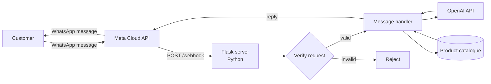

<div align="center">

# WhatsApp AI Assistant

**An interactive WhatsApp bot built on the Meta Cloud API, using OpenAI to generate conversational responses — the conversational front-end for [Velo.Stor](https://github.com/El-Tousy/VELO-STOR-Online-Store).**

[**🔗 Companion project — Velo.Stor**](https://github.com/El-Tousy/VELO-STOR-Online-Store) · [**📄 Deutsch**](README.de.md)


</div>

---

## Table of Contents

- [Overview](#overview)
- [Features](#features)
- [Architecture](#architecture)
- [Tech Stack](#tech-stack)
- [Project Structure](#project-structure)
- [Getting Started](#getting-started)
- [Environment Variables](#environment-variables)
- [API Endpoints](#api-endpoints)
- [Testing](#testing)
- [CI/CD](#cicd)
- [Deployment](#deployment)
- [Technical Challenges and Learnings](#technical-challenges-and-learnings)
- [Roadmap](#roadmap)
- [Related Project](#related-project)
- [Author](#author)
- [License](#license)

---

## Overview

This project is a webhook server that turns WhatsApp into a conversational storefront. It receives customer messages through the **Meta WhatsApp Cloud API**, interprets them with the **OpenAI API**, and replies automatically — using the same product catalogue as the [Velo.Stor](https://github.com/El-Tousy/VELO-STOR-Online-Store) website.

The goal is to let a customer ask about bikes, e-bikes or scooters directly in a WhatsApp thread — no app install, no website visit required — which matches how small businesses actually sell in markets where WhatsApp is the primary commerce channel.

> **Note on scope.** This is an internship / learning project. The bot and the catalogue it draws from use sample data; it is not a production commercial deployment.

---

## Features

- **Webhook verification** — handles Meta's `GET /webhook` handshake (`hub.challenge` / `hub.verify_token`)
- **Inbound message handling** — receives and parses `POST /webhook` payloads from the Meta Cloud API
- **AI-generated replies** — customer messages are sent to the OpenAI API, which generates a natural-language response grounded in the product catalogue
- **Shared catalogue** — answers are based on the same product data as the Velo.Stor website, so the two front-ends stay consistent
- **Signature / token verification** — validates incoming requests before processing them
- **Structured logging** — request and error logs for debugging webhook delivery issues
<!-- TODO: confirm/adjust this list against what the bot actually does (e.g. media messages, quick replies, handoff to a human agent, order status lookups) -->

---

## Architecture



Meta forwards every inbound WhatsApp message to this server's webhook. The server verifies the request, builds a prompt that combines the customer's message with relevant catalogue data, sends it to the OpenAI API, and returns the generated reply to the customer through the Meta Cloud API — the same catalogue the [Velo.Stor](https://github.com/El-Tousy/VELO-STOR-Online-Store) website displays.

---

## Tech Stack

| Layer | Technology | Why |
|---|---|---|
| Language | Python 3.11+ | — |
| Web framework | Flask | Lightweight webhook server, no unnecessary overhead |
| Messaging | Meta WhatsApp Cloud API | Official, no third-party WhatsApp automation risk |
| AI layer | OpenAI API | Natural-language understanding and reply generation |
| CI/CD | GitHub Actions | Lint, test and (optionally) deploy on every push |
| Hosting | <!-- TODO: e.g. Render / Railway / Fly.io / a VPS --> | — |
| Versioning | Git & GitHub | — |

---

## Project Structure

```
Meta-API-python-whatsapp-bot/
│
├── app.py                     # Flask entry point, route registration
├── webhook/
│   ├── verify.py              # GET /webhook handshake with Meta
│   └── handler.py             # POST /webhook message processing
├── services/
│   ├── meta_client.py         # Sends replies via the Meta Cloud API
│   └── openai_client.py       # Builds prompts and calls the OpenAI API
├── catalogue/
│   └── products.json          # Shared product data (mirrors Velo.Stor)
├── tests/
│   └── test_webhook.py        # Unit tests for webhook verification and handling
├── .github/
│   └── workflows/
│       └── ci.yml             # Lint + test pipeline
├── .env.example                # Template for required environment variables
├── requirements.txt
├── LICENSE
└── README.md
```

> This structure reflects the intended organisation of the project. <!-- TODO: replace with the actual file layout if it differs -->

---

## Getting Started

### Prerequisites

- Python 3.11 or later
- A [Meta Developer](https://developers.facebook.com/) account with a WhatsApp Business app configured
- An [OpenAI API](https://platform.openai.com/) key
- `pip` and, optionally, a virtual environment tool (`venv`, `poetry`, etc.)

### Installation

```bash
git clone https://github.com/El-Tousy/Meta-API-python-whatsapp-bot.git
cd Meta-API-python-whatsapp-bot

python -m venv venv
source venv/bin/activate   # Windows: venv\Scripts\activate

pip install -r requirements.txt
```

### Configuration

```bash
cp .env.example .env
# then edit .env with your own values — see Environment Variables below
```

### Running locally

```bash
python app.py
# or: flask run
```

To receive real WhatsApp messages during local development, expose your local server with a tunnel (e.g. `ngrok http 5000`) and register the resulting HTTPS URL as your webhook callback URL in the Meta Developer dashboard.

---

## Environment Variables

| Variable | Description |
|---|---|
| `WHATSAPP_TOKEN` | Access token for the Meta Cloud API (system user token) |
| `PHONE_NUMBER_ID` | ID of the WhatsApp Business phone number sending/receiving messages |
| `VERIFY_TOKEN` | Arbitrary string you choose; must match the value entered in the Meta webhook configuration |
| `APP_SECRET` | App secret used to verify Meta's request signature |
| `OPENAI_API_KEY` | API key for the OpenAI API |
| `PORT` | Port the Flask server listens on (default `5000`) |

<!-- TODO: confirm exact variable names against the real .env.example -->

---

## API Endpoints

| Method | Path | Description |
|---|---|---|
| `GET` | `/webhook` | One-time verification handshake used by Meta when registering the webhook |
| `POST` | `/webhook` | Receives inbound WhatsApp messages and triggers the reply flow |
| `GET` | `/health` | Basic health check, returns `{ "status": "ok" }` |

<!-- TODO: add/adjust rows if the bot exposes more routes (e.g. an admin endpoint, a catalogue reload endpoint) -->

---

## Testing

```bash
pytest
```

Tests cover webhook signature verification and message-handling logic in isolation, using mocked Meta and OpenAI responses so the suite doesn't depend on live credentials.
<!-- TODO: adjust once the real test suite exists -->

---

## CI/CD

Continuous integration runs on every push and pull request via **GitHub Actions** (`.github/workflows/ci.yml`):

```yaml
name: CI

on:
  push:
    branches: [main]
  pull_request:
    branches: [main]

jobs:
  lint-and-test:
    runs-on: ubuntu-latest
    steps:
      - uses: actions/checkout@v4

      - name: Set up Python
        uses: actions/setup-python@v5
        with:
          python-version: "3.11"

      - name: Install dependencies
        run: |
          pip install -r requirements.txt
          pip install flake8 pytest

      - name: Lint
        run: flake8 .

      - name: Run tests
        run: pytest
```

The pipeline:
1. **Lints** the codebase with `flake8` to catch style and obvious correctness issues before merge
2. **Runs the test suite** with `pytest` on every push and pull request targeting `main`
3. <!-- TODO: add a deploy job (e.g. trigger a Render/Railway deploy hook, or push to a VPS via SSH) once a hosting provider is chosen -->

A branch protection rule on `main` requiring this workflow to pass is recommended before merging pull requests.

---

## Deployment

<!-- TODO: fill in once a hosting provider is chosen. Example structure below. -->

| Setting | Value |
|---|---|
| Hosting | TODO |
| Trigger | Push to `main` |
| Environment variables | Configured in the hosting provider's dashboard, mirroring `.env.example` |
| Webhook URL | Registered in the Meta Developer dashboard → WhatsApp → Configuration |

---

## Technical Challenges and Learnings

- **Meta's webhook verification handshake.** The `GET /webhook` challenge/response flow, plus signature verification (`X-Hub-Signature-256`) on every `POST`, has to be implemented correctly or Meta will silently stop delivering messages — there is no verbose error returned to the developer.
- **Prompting for grounded answers.** Getting the OpenAI API to answer from the actual product catalogue, rather than inventing plausible-sounding but wrong details, took more prompt iteration than the integration code itself.
- **Sharing one source of truth with the website.** Keeping the bot's catalogue and the Velo.Stor website's catalogue in sync is the main design constraint of the whole two-repo system.
- <!-- TODO: add any other real challenges — e.g. WhatsApp message-template approval, rate limits, latency of the OpenAI call inside the webhook response window -->

---

## Roadmap

- [x] Webhook verification and message handling
- [x] OpenAI-generated replies
- [x] Shared catalogue with the Velo.Stor storefront
- [ ] Automated deploy job in the CI/CD pipeline
- [ ] Conversation history / context per customer
- [ ] Human handoff for requests the bot can't answer
- [ ] Structured order/status lookups
- [ ] Expand test coverage

---

## Related Project

**[Velo.Stor](https://github.com/El-Tousy/VELO-STOR-Online-Store)** — the RTL Arabic e-commerce website this bot shares its catalogue with.

---

## Author

**El-Tousy** — Computer Science student, Morocco

[](https://github.com/El-Tousy)
[](mailto:leilaeltousy@gmail.com)

---

## License

Released under the MIT License. See [LICENSE](LICENSE) for details.

---

<div align="center">

⭐ If this project is useful to you, consider leaving a star.

</div>
